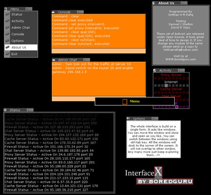



## InterfaceX \(Updated\)

### Description

A cool interface done in visual bacis. If you see the screen shot. The whole program was done in a single form. And All the others are activex.

The best thing about this is all are movable, dockable. etc etc. Have fun with the code it is opensource and if you like it please vote for me...
 
### More Info
 

             |
---                |---
**Submitted On**   |2003-09-09 12:03:02
**By**             |[Imthiaz Rafiq](https://github.com/Planet-Source-Code/PSCIndex/blob/master/ByAuthor/imthiaz-rafiq.md)
**Level**          |Advanced
**User Rating**    |3.3 (40 globes from 12 users)
**Compatibility**  |VB 6\.0
**Category**       |[Custom Controls/ Forms/  Menus](https://github.com/Planet-Source-Code/PSCIndex/blob/master/ByCategory/custom-controls-forms-menus__1-4.md)
**World**          |[Visual Basic](https://github.com/Planet-Source-Code/PSCIndex/blob/master/ByWorld/visual-basic.md)
**Archive File**   |[InterfaceX1643859102003\.zip](https://github.com/Planet-Source-Code/imthiaz-rafiq-interfacex-updated__1-48363/archive/master.zip)

